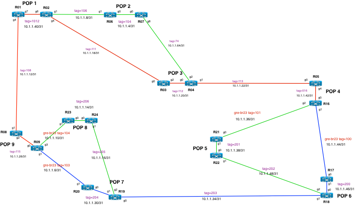

# xrv9kvm
A little tool for building xrv9k virtual router topologies on KVM, without the need for orchestrators like Openstack

1. hardware/OS requirements: 
    * ubuntu 20.04 or 18.04
    * CPU, memory, and disk requirements will depend on number of routers.  a 5 router topology would require 10 vCPU, 70GB of memory, and 250GB disk
      * the datasheet says to deploy xrv9k with 4 vCPU and 16G of memory per VM.  I've run them very stably with 2 vCPU and 14G of memory.

2. required packages:
    * openssh-server qemu qemu-kvm libvirt-bin openvswitch-switch
    * optional: virt-manager

3. clone this repository:
```
git clone https://github.com/brmcdoug/xrv9kvm.git
```

4. mkdir /opt/images/
5. download xrv9k tarball from CCO (the non-RR one is fine) and move it into /opt/images
6. untar and create kvm .img files from the qcow2.  Examples:
```
qemu-img create -b  xrv9k-fullk9-x-7.3.1.qcow2 -f qcow2 r01.img
qemu-img create -b  xrv9k-fullk9-x-7.3.1.qcow2 -f qcow2 r02.img
qemu-img create -b  xrv9k-fullk9-x-7.3.1.qcow2 -f qcow2 r17.img
etc.
```
7. create or edit the example "start_node.py" file which maps your router VM interfaces to OVS bridge and vlan instances. 

(yes, this is super hard-codey, but remember no Openstack required)


See example diagram


9. create OVS bridges and linux IP addrs
 

```
sudo chmod 755 ovs_plumbing.sh 
sudo ./ovs_plumbing.sh

# shell script comes with default settings for router mgt and "production" bridges and IP addrs. please edit to suit your env

```
9. start nodes

```
sudo chmod 755 start_node.py

sudo ./start_node.py r01
sudo ./start_node.py r02
sudo ./start_node.py r17
etc.
```
10. access router VM's console port and see if they're booting (fingers crossed)

```
r01:
telnet 0 20010

r02:
telnet 0 20020

r17:
telnet 0 20170

etc.
```

11. they take a long time to boot
12. more than enough time to make a fresh pot of coffee or a sandwich
13. configure routers
